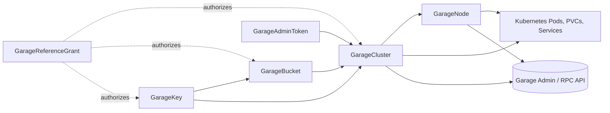

# Architecture

The operator reconciles Kubernetes resources and Garage's Admin/RPC APIs as one system. Kubernetes owns the desired workload and identity boundary; Garage owns the distributed object layout and data placement.

## Resource relationships

The API group is `garage.rajsingh.info`. `GarageCluster` is served as `v1beta2` and the deprecated `v1beta1`; the other operator CRDs are currently `v1beta1`.

## Controllers and ownership

| Resource | Primary responsibility | Kubernetes artifacts |
| --- | --- | --- |
| `GarageCluster` | Cluster config, tier topology, services, layout coordination, health, federation, operations | StatefulSets, node-local-pool DaemonSets, Services, ConfigMaps, PDBs, endpoint Services, generated `GarageNode`s |
| `GarageNode` | One Garage identity and layout role | Usually one single-replica StatefulSet, PVCs, ConfigMap, and RPC Service; node-local pool members run in the parent pool DaemonSet |
| `GarageBucket` | Bucket, aliases, quotas, website, lifecycle, grants | Generated Secret relationships and Garage-side bucket state |
| `GarageKey` | S3 key material and permissions | Generated Kubernetes Secret and Garage-side key/grants |
| `GarageAdminToken` | Static Admin API bootstrap token Secret | Generated Kubernetes Secret; it does not create a revocable Garage token row |
| `GarageReferenceGrant` | Cross-namespace reference authorization | No workload; status reports users |

## Reconciliation boundaries

The operator uses the Garage Admin API v2 for cluster, node, layout, bucket, key, token, lifecycle, repair, and health operations. It does not shell out to a Garage CLI in the controller.

Kubernetes admission is part of the safety design. The webhooks validate topology, immutable identity-sensitive fields, cross-namespace references, reserved environment variables, scale requests, node-local prerequisites, and prepared deletion. Running without them can remove important safety boundaries even when the controller binary starts.

Leader election is required by supported installations because layout mutation is serialized through process-local and cluster-level coordination. A disabled leader election is an explicitly unsupported single-manager mode and must be acknowledged in Helm values.

## Workload shapes

- Default Auto storage: one `GarageNode` and one single-replica StatefulSet per storage slot.
- Unified Auto gateway: one gateway `GarageNode` and one single-replica StatefulSet per gateway identity.
- Edge gateway: one cluster-level StatefulSet, because the remote storage cluster owns its layout roles.
- Node-local pool: one DaemonSet per named pool plus generated `GarageNode` identities for selected Kubernetes Nodes.
- External `GarageNode`: no workload; the operator manages a role for a process that exists elsewhere.
- Management handle: no workload; the operator manages the external Admin API target.

The [storage identity guide](storage-and-layout.md) explains why these shapes cannot be freely converted or scaled interchangeably.
